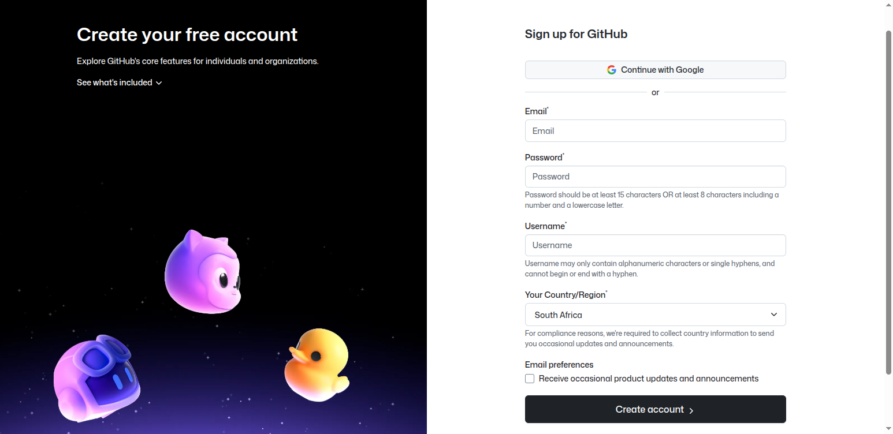
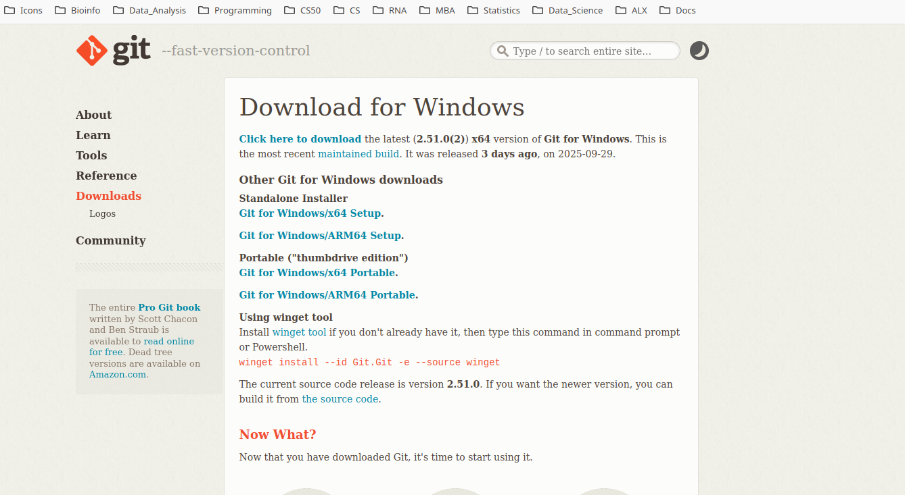
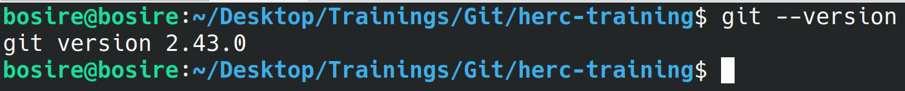
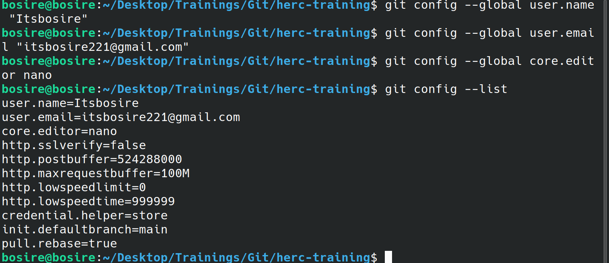
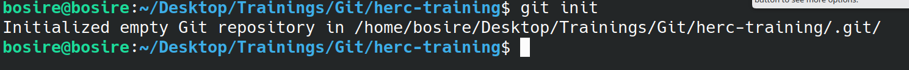
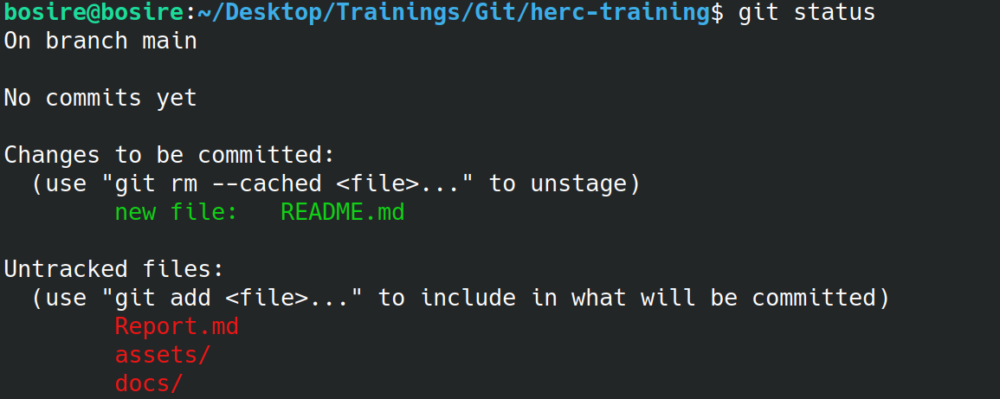
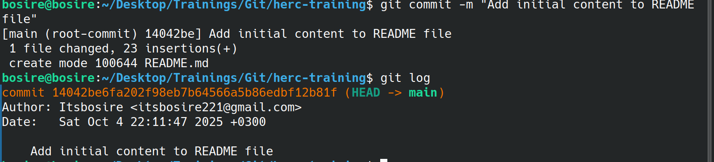
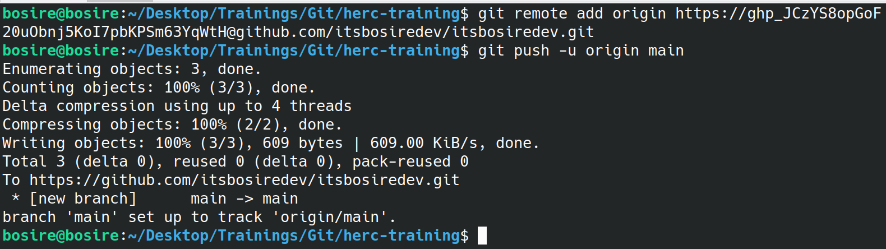

# Introduction to Git and GitHub Training

## Overview

This training session is designed to introduce participants to the fundamental concepts and practical applications of Git and GitHub. By the end of this session, participants will have a solid understanding of version control, how to use Git for managing code, and how to collaborate using GitHub.

## Objectives

- Introduction to Version Control Git and GitHub
- Setting Up Git and GitHub
- Basic Git Commands
- Branching and Merging
- Collaborating on GitHub
- Best Practices and Tips
- Introduction markdown

## What is Version Control?

Version control is a system that records changes to files over time so that you can recall specific versions later. It allows multiple people to work on the same project without overwriting each other's changes, making it easier to manage and collaborate on code.

## Introduction to Git(what is Git?)

Git is a version control tool that track changes in files and stores the history of those changes. It allows multiple developers to work on the same project simultaneously, making it easier to manage code and collaborate effectively.

## Why Use Git?

- keep track of changes made in files
- Review and revert to previous versions of files
- Sychronize file chages among multiple people
- Test changes without affecting the main project

## Why Git?

- **Speed**: Git is fast and efficient, allowing for quick operations.
- Performance: Git is designed to handle large projects efficiently.
- **Flexibility**: Git supports various workflows and branching strategies.
- **Distributed**: Every developer has a full copy of the repository, enabling offline work and reducing reliance on a central server.
- **Strong Community**: Git has a large and active community, providing extensive resources and support.
- **Integration**: Git integrates well with various tools and platforms, including GitHub.
- **Open Source**: Git is free and open-source, making it accessible to everyone.
- **Widely Adopted**: Git is the most widely used version control system in the world, making it a valuable skill for developers.

## What is GitHub?

- GitHub is a web-based platform that uses Git for version control and collaboration. It provides a user-friendly interface for managing repositories, tracking issues, and collaborating with other developers.
- It is basically a web storage for Git repositories.

## Why GitHub is Important?

- free hosting for public repositories
- easy collaboration with other developers
- issue tracking and project management tools
- integration with other tools and services
- community and networking opportunities
- works best with multiple file extensions i.e. .py, .ipynb, .r, .md, .txt etc.

## Terminology

- **Repository (Repo)**: A storage space for your project, including all files and their history.
- **Commit**: A snapshot of changes made to the files in a repository.
- **Branch**: A separate line of development in a repository, allowing for parallel work on different features or fixes.
- **Merge**: The process of integrating changes from one branch into another.
- **Clone**: A copy of a repository that you can work on locally.
- **Fork**: A personal copy of someone else's repository, allowing you to make changes without affecting the original.
- **Pull Request (PR)**: A request to merge changes from one branch or fork into another, often used for code review and collaboration.
- **Remote**: A version of the repository hosted on a server, such as GitHub.
- Push: The action of sending your local commits to a remote repository.
- **Pull**: The action of fetching and integrating changes from a remote repository into your local copy.
- **Staging Area**: A temporary area where changes are prepared before committing them to the repository.
- **HEAD**: A reference to the current commit in the repository, typically pointing to the latest commit on the current branch.
- **Tag**: A marker for a specific point in the repository's history, often used to denote releases or important milestones.
- **Conflict**: A situation that arises when changes from different branches or commits cannot be automatically merged, requiring manual resolution.
- **Diff**: A comparison of changes between two versions of a file or set of files, showing what has been added, removed, or modified.
- **Blame**: A feature that shows who made changes to each line of a file, useful for tracking the history of specific lines.
- **Gitignore**: A file that specifies which files or directories should be ignored by Git, preventing them from being tracked or committed.
- **Remote Tracking Branch**: A local branch that tracks the state of a branch in a remote repository, allowing you to see changes made by others.
- **Origin**: The default name for a remote repository when you clone it, typically referring to the original repository you cloned from.
- **Upstream**: The main repository that your forked repository is based on, often used to refer to the original source of a project.
- **local repository**: A version of the repository stored on your local machine, where you can make changes and commits.
- **Remote Repository**: A version of the repository hosted on a server, such as GitHub, where multiple collaborators can access and contribute to the project.
- **commit history**: A record of all commits made to a repository, showing the changes made over time and who made them.

### Setting Up Git and GitHub

1. Create a GitHub account if you don't have one already by signing up at [GitHub](https://github.com/)

Kindly follow the instructions to create your account.


2. Install Git for your windows operating system from [here](https://git-scm.com/downloads/win)
This is how the landing page looks like:


Confirm the version of git you have downloded by running the following command in your terminal or git bash:

```bash

git --version
```

Here is how the output looks like:


3. After downloading, run the installer and follow the setup instructions. You can generally keep the default settings.
4. Set up your Git username and email in the terminal or command prompt:

```bash
git config --global user.name "Your Name"
```

```bash
git config --global user.email "Your Email"
```

A typical output looks like this:

Replace "Your Name" and "Your Email" with your actual name and email address associated with your GitHub account.

5. Adding profile picture and other details in GitHub account:
   - Click on your profile picture at the top right corner and select "Your profile".
   - Click on "Edit profile" button to add or change your profile picture, bio, location, and other details.
   - Make sure to save your changes.

Creating your first special **username/username** repository that will always be the landing page for your profile.
First things first download a mardown editor of your choice. I would recommend using Obsidian which is free and open source. 
You can download it from [here](https://obsidian.md/download).
If you want to use an all in one solution you can use [StackEdit](https://stackedit.io/app#) which is an online markdown editor.
In adition, you can use [Visual Studio Code](https://code.visualstudio.com/) which is a code editor but also supports markdown files(this is what we are going to use in this training).
Please download and install Visual Studio Code from the above link if you don't have it already [here](https://code.visualstudio.com/Download)

Also, to learn more about markdown you can visit [this link](https://www.markdownguide.org/getting-started/)

Follow these steps to create a repository named `<your-username>/<your-username>:`:

- Go to your GitHub profile.
- Click on the "Repositories" tab.
- Click on the "New" button to create a new repository.
- Name the repository as `<your-username>.github.io` (replace `<your-username>` with your actual GitHub username).
- Set the repository to "Public".
- Optionally, add a description.
- Check the box to initialize the repository with a README file.( Usng mardown language to add content in README file)
An example of creating a repository is shown below:
[Video Link](https://drive.google.com/file/d/1omcVRw9_LeleUgiPqiYpNYLz6jO8Kv2q/view?usp=sharing)

Now having created a repository, we need to add content to our README file using markdown language, and push the changes to GitHub.
We are going to add content to our README and initialize a local repository, commit the changes and push them to GitHub.

Here is the snapshot of the steps to follow:

- Open git bash or terminal and navigate to the directory where you want to store your local repository.
- Add content to your README file using markdown language. You can use the example provided in the `Report.md` file as a reference.
Having added content to your README file, follow these steps:
- Initialize a local Git repository using the command:

  ```bash
  git init
  ```



- Add the README file to the staging area using the command:

```bash
git add README.md
```

- Check the status of your repository using the command:

```bash
git status
```

You should see that the README file is in the staging area.


- Commit the changes with a descriptive message using the command:

```bash
git commit -m "Add initial content to README"
```

- Verify the commit using the command:

```bash
git log
```

You should see the commit you just made.


- Link your local repository to the remote GitHub repository using the command. A point to note is that you need to generate a personal access token from your GitHub account and use it instead of your password when prompted. You can generate a personal access token by following the instructions [here](https://docs.github.com/en/github/authenticating-to-github/creating-a-personal-access-token).
A video showing how to generate a personal access token is shown below:
[Watch video](https://drive.google.com/file/d/169eGk87rSxtcqJT4w0nGfLiGrDq_ciyL/view?usp=sharing)

Now we need to our personal access token and the link to our remote repository to link our local repository to the remote repository.

```bash
git remote add origin https://your_personal access token@github.com/itsbosiredev/.github.git
```

Having linked the local repository to the remote repository, we can now push our changes to GitHub using the command:

```bash
git push -u origin main 
```


Replace the URL with the URL of your remote repository. The URL can be found on the main page of your repository on GitHub.
[Video Link](https://drive.google.com/file/d/1q86Dz3gDmzy0W8lbsQ9ORuRKQrc2MbpI/view?usp=sharing)

Having linked and pushed changes to GitHub, you can now view your repository on GitHub to see the changes reflected in the README file.

### Synchronizing Your Local Repository with GitHub

- If we make changes to our README file or any other file in our remote repository on GitHub, we need to synchronize those changes with our local repository.
- To do this, we can use the `git pull` command to fetch and merge changes from the remote repository to our local repository.

```bash
git pull origin main
```

- This command fetches the changes from the `main` branch of the remote repository and merges them into our local `main` branch.

### cloning a repository

- To clone a repository from GitHub to your local machine, you can use the `git clone` command followed by the URL of the repository.

```bash
git clone url_of_the_repository
```

- Replace `url_of_the_repository` with the actual URL of the repository you want to clone. You can find the URL on the main page of the repository on GitHub.
- This command creates a copy of the repository on your local machine, allowing you to work on it locally.

### forking a repository

- To fork a repository on GitHub, go to the repository you want to fork and click on the "Fork" button at the top right corner of the page.
- This creates a copy of the repository under your GitHub account, allowing you to make changes without affecting the original repository.
- You can then clone your forked repository to your local machine using the `git clone` command as described above.

- After making changes to your forked repository, you can create a pull request to propose your changes to the original repository. This allows the maintainers of the original repository to review and potentially merge your changes.
- To create a pull request, go to your forked repository on GitHub and click on the "Pull Request" button. Follow the instructions to create a new pull request, providing a description of the changes you made and why they should be merged into the original repository.

#### Additional Resources

- [Slides](https://docs.google.com/presentation/d/1CUCHkxINM2EVOJqs--WzgKubVf6eUiEf/edit?usp=sharing&ouid=100433825166515123610&rtpof=true&sd=true)
- [Pro Git Book](https://git-scm.com/book/en/v2)
- [GitHub Learning Lab](https://lab.github.com/)
- [Git Cheat Sheet](https://education.github.com/git-cheat-sheet-education.pdf)
- [Git Documentation](https://git-scm.com/doc)
